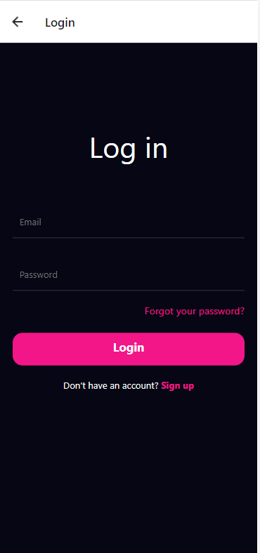
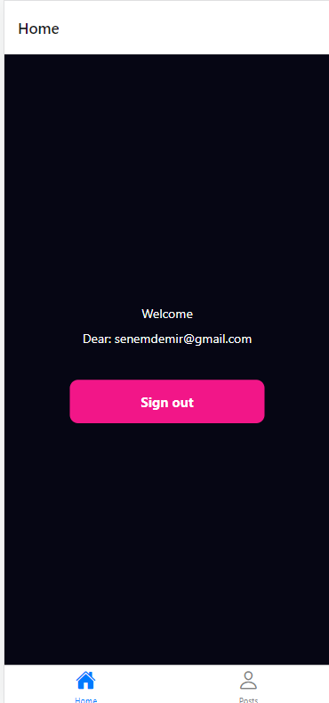
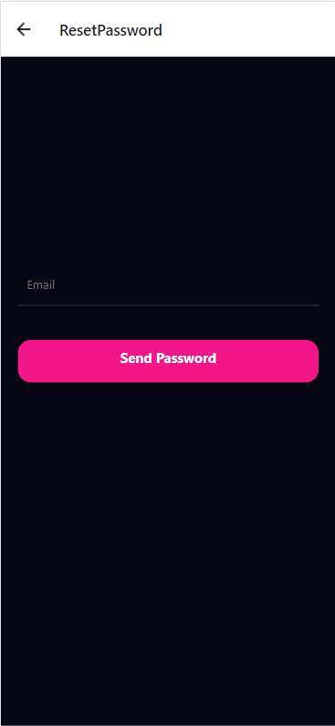
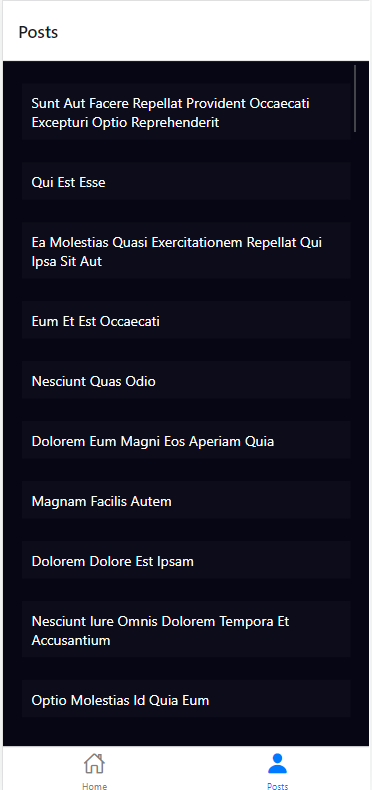

[](https://classroom.github.com/online_ide?assignment_repo_id=7017674&assignment_repo_type=AssignmentRepo)
# 3. Week - React Native App

- Login ve Menu kısımlarının bulanacağı React Native App oluşturulacak
- JSONPlaceholder API ve axios kullanarak postlar listelenecek
- Son tarih: 20.02.2022 14:00

Firebase ve React Native kullanarak giriş, şifremi unuttum, kayıt ol, ana sayfa ve "https://jsonplaceholder.typicode.com/posts" adresinden aldığım postların olduğu sayfalar oluşturdum.







-ReactNative

-axios

-Firebase

-https://jsonplaceholder.typicode.com/posts

## Kurulum

```sh
git clone https://github.com/171-Logo-Siber-FullStack-Bootcamp/week2-assignment-senemdemirr.git
cd week2-assigment-senemdemirr
cd mobileApp
npm i
expo start
```

## Dosya Yapısı

```
.mobileApp
├─ expo
├─ expo-shared
├─ assets
├─ node-modules
├─ src
 |      ├─ config
 |       |      └─ colors.js
 |      ├─ navigations
 |       |      └─ TabMenu.js
 |      ├─ screens
 |       |      ├─ Home.js
 |       |      ├─ index.js
 |       |      ├─ Login.js
 |       |      ├─ Main.js
 |       |      ├─ Posts.js
 |       |      ├─ Register.js
 |       |      └─ ResetPassword.js
 |      └─ services
├─ App.js
├─ app.json
├─ babel.config.js
├─ firebase-config.js
├─ firebase-origin.js
├─ package-lock.json
└─ package.json

```
